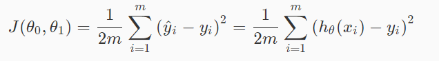
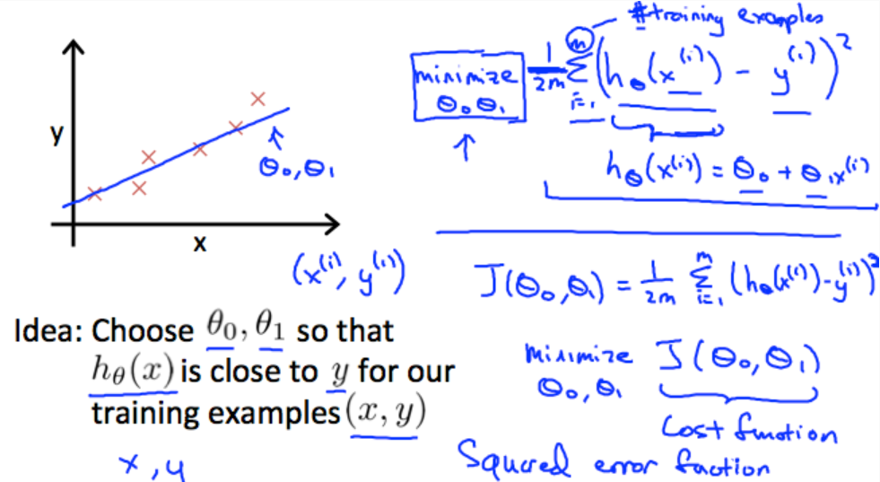
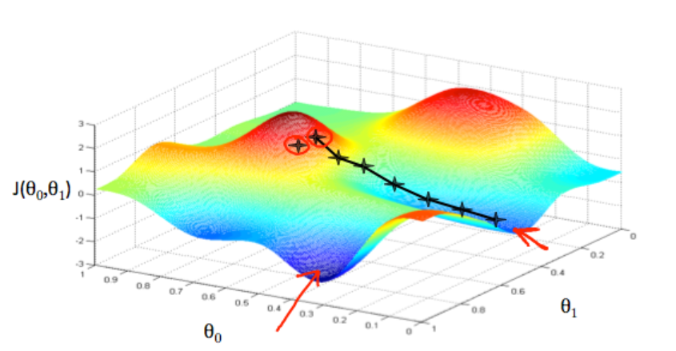
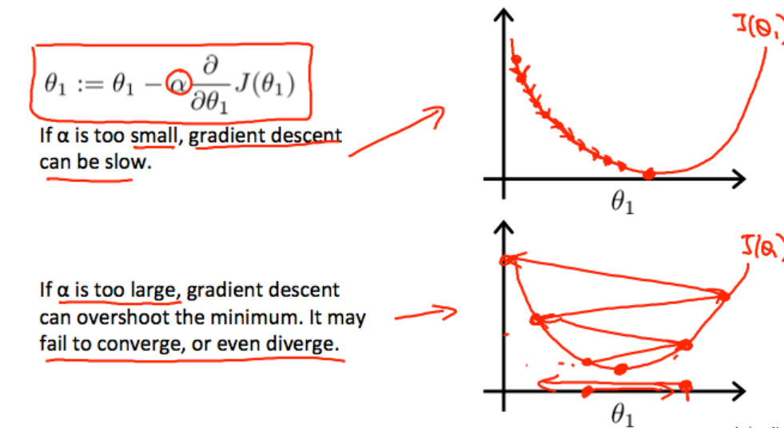
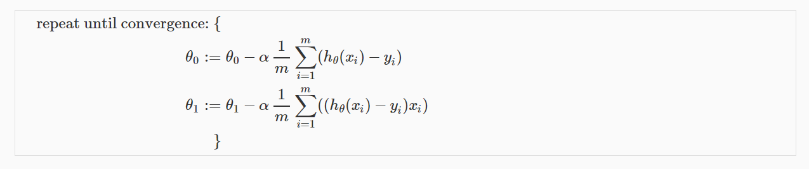

## #1 Notes

###Introduction

> A computer program is said to learn from experience E with respect to some class of tasks T and performance measure P, if its performance at tasks in T, as measured by P, improves with experience E.  (Tom Mitchell)

#### Supervised Learning

> We are given a data set and already know what our correct output should look like.

* **Regression**

  predict results within a continuous output.

  *eg: Given data about the size of houses on the real estate market, try to predict their price.* 

* **Classification**

  predict results in a discrete output. 

  *eg: Given a patient with a tumor, predict whether the tumor is malignant or benign.* 

####Unsupervised Learning

> We can derive structure from data where we don't necessarily know the effect of the variables. 

* Clustering

  *Eg: Take a collection of 1,000,000 different genes, and find a way to automatically group these genes into groups that are somehow similar or related by different variables, such as lifespan, location, roles, and so on.*

* Non-clustering

  *Eg: The "Cocktail Party Algorithm", allows you to find structure in a chaotic environment. (i.e. identifying individual voices and music from a mesh of sounds at a cocktail party).*

### Model and Cost Function

#### Model Representation

> se $x^{(i)}$ to denote the “input” variables (living area in this example), also called input features, and $y^{(i)}$ to denote the “output” or target variable that we are trying to predict (price). A pair ($x^{(i)}$ , $y^{(i)}$ ) is called a training example, and the dataset that we’ll be using to learn—a list of m training examples ($x^{(i)}$, $y^{(i)}$); i=1,...,m is called a training set.  

#### Cost Function

> We can measure the accuracy of our hypothesis function by using a **cost function**. This takes an average difference (actually a fancier version of an average) of all the results of the hypothesis with inputs from x's and the actual output y's. 

**illustration**

> Also *Squared error function*
>
> Our goal is to minimize the cost function

#### Gradient Descent

> To reach the bottom (minimum value), we can take the derivative (the tangential line to a function) of our cost function. The slope of the tangent is the derivative at that point and it will give us a direction to move towards. We make steps down the cost function in the direction with the steepest descent. The size of each step is determined by the **parameter α**, which is called the **learning rate**. 

The gradient descent algorithm is:

repeat until convergence:

$$\theta_j := \theta_j - \alpha \frac{\partial}{\partial \theta_j} J(\theta_0, \theta_1)$$

where j=0,1 represents the feature index number

> We should adjust our parameter $\alpha$ to ensure that the gradient descent algorithm converges in a reasonable time. Failure to converge or too much time to obtain the minimum value imply that our step size is wrong. 

For **Linear Regression**, We can substitute our actual cost function and our actual hypothesis function and modify the equation to : 

where m is the size of the training set, $\theta_0$ a constant that will be changing simultaneously with$ \theta_1$ and $x_{i}, y_{i}$are values of the given training set (data). 